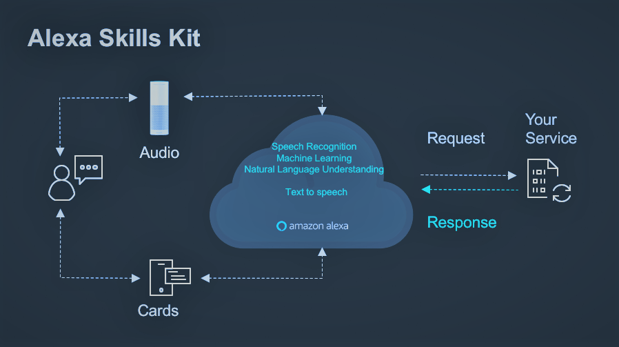

# **Alexa Skill - FamilyTree (Stammbaum)**

**Unser Skill soll Personen helfen, sich an vergessene Sachen von Freunden oder**
**Familie (Namen, Hobby, Wohnort, Geburtstag etc.), durch Interaktion mit Alexa,**
**wieder zu erinnern.**

## Anwendung in der Theorie

### Sicht des Nutzers
Unser Alexa Skill steht jedem Besitzer einer Alexa kostenlos zur Verfügung.
Durch natürliche Abfragen, wie zum Beispiel "Wie heißt die Tochter meines Bruders?"
oder "Wie heißt mein Enkel, der gerne Fußball spielt?", kann der Nutzer Alexa
auffordern in einer Datenbank, mit den gegebenen Informationen die gesuchte Person zu finden und dann das Ergebnis bzw. die Ergebnisse zurückzuliefern.

### Sicht der Angehörigen
Die Angehörigen (Familie und Freunde) können sich auf einer Weboberfläche anmelden
und dort ihre Daten (Name, Vorname, Beziehungsverhältinis, Hobbys, Beruf etc.) eingeben,
welche dann in einer Datenbank eingetragen werden.

## Anwendung in der Praxis

### Nutzung im Alltag
Den Alexa Skill kann man erst benutzen, wenn man "Alexa, starte Stammbaum" sagt.
Danach kommt man in die "Frage - Antwort"-Routine, in der Alexa versucht, die gesuchte Person, wenn nötig mit Nachfragen, zu finden.

## Aktueller Stand
Im der jetzigen Version des Skills können die Angehörigen ihre Daten über eine Website in eine Datenbank eintragen.
Dort bezieht sich die Verwandschaftsbeziehung  derzeit nur direkt auf die Beziehung zwischen dem Betroffenen und dem Angehörigen. Es können noch keine besonderen Beziehungen wie "Stammfriseur" oder "Gärtner" eingetragen werden.

Der Betroffenen hat die Möglichkeit Informationen über Telefonnummer, Arbeit, Hobbys, Alter, Geburtstag sowie Namen über die Verwandschaftsbeziehung zur jeweiligen Person zu erhalten.
Wenn die betroffene Person die Beziehung nicht genau weiß, besteht die Möglichkeit die "über ein Eck" (zum Beispiel "Wie heißt der Bruder meines Vaters") die Informationen zu erhalten.

Intern wird dann die Beziehung von den, in der Fragestellung benannten, "Ecken" bestimmt und dann mit dem Ergebnis (Ergebnis von "Bruder meines Vaters" ist zum Beispiel "Onkel") in der Datenbank dann nach Personen mit dieser Eigenschaft gesucht.

## Art des Projektes
Dieses Projekt ist open source. 
Es wurde durchgeführt im Rahmen des Praktikums zur Vorlesung Software Engeneering 1 der Hochschule München. 
Begleitet wurde das Projekt von AWS und der Alzheimer Gesellschaft München e.V.. 

## Verwendete Technologien
Folgende Technologien wurden verwendet: 
- Java
- Maven
- git
- Alexa Developer Console
- Jenkins
- gitLab runner
- SonarQube
- AWS (Amazon Web Services)

##

Das Backend wurde in Java implementiert. 
Java wurde gewält, da wird mit dieser Programmiersprache durch die Vorlesung Softwareentwicklung 1 und Softwareentwicklung 2 am Besten vertraut sind.  
Weitere Informationen zu Java findet man unter folgender URL: [https://www.java.com/de/download/](https://www.java.com/de/download/)

Maven wurde als Build-Management-Tool verwendet. 
Ein Build-Management-Tool ist notwendig, um die nötigen Bibliothekten für den Alexa Skill automatisiert in den Build Process einzufügen.  
Weitere Informationen zu Maven findet man unter folgender URL: [https://maven.apache.org/](https://maven.apache.org/)

Wir arbeiten zu dritt an diesem Projekt. 
Um besser gemeinsam an den source code arbeiten zu können, benötigten wir ein Versionsverwaltung. 
Uns wurde gitLab vom Leibniz-Rechenzentrum zur Verfügung gestellt.  
Das Repository ist unter folgender URL zu erreichen: [https://gitlab.lrz.de/swe_ws2019_20/swe-Do-22](https://gitlab.lrz.de/swe_ws2019_20/swe-Do-22) 

Da es sich bei diesem Projekt um ein Alexa Skill handelt, müssen wir das Alexa Skill Kit verwenden.  
Die [Alexa Developer Console](https://developer.amazon.com/de-DE/alexa/) hilft und dabei den Skill zu Testen und zu Erstellen: 

Da wir einen Skill für Amazon Alexa entwickeln, bietet es sich an, den Skill auf der Amazon Web Services Cloud zu hosten. 
Da wir eine Cloud Lösung verwenden, müssen wir nicht ein Rechenzentrum betreiben.  
Weitere informationen zu AWS findet man unter folgender URL: [https://aws.amazon.com/de/](https://aws.amazon.com/de/)
